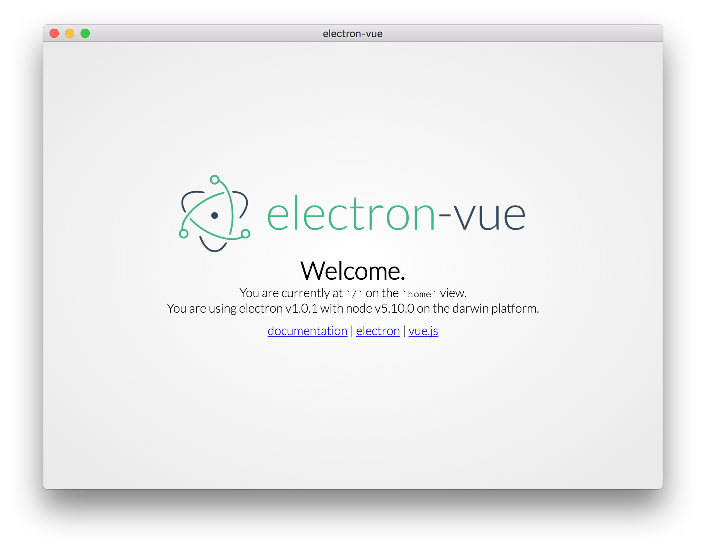

# Development

## Starting the app
```bash
npm run dev
```
...and boom! You now have a running electron-vue app.

This boilerplate comes with a few landing-page components that are easily removable.

## vue-devtools
Once the app is loaded, another window will be opened that loads the vue-devtools. These tools will open by default and can be manually turned off in `config.js` by setting `vueDevTools` to `false`.

**NOTE**: The current method of opening the vue-devtools currently opens a new window each time webpack needs a hard refresh.

## devtron
Electron's devtron devtools are enabled by default and can be turned off from `config.js`.
