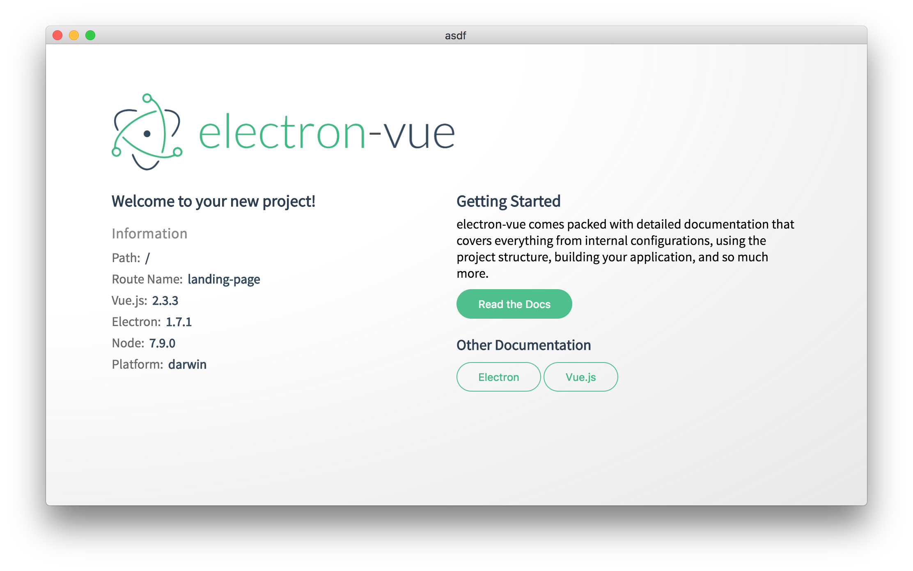

# Development

### Starting the development setup

After you have installed dependencies with `yarn` or `npm install`, then run...

```bash
yarn run dev # or npm run dev
```

...and boom! You now have a running electron-vue app.  


This boilerplate comes with a few landing-page components that are easily removable.

